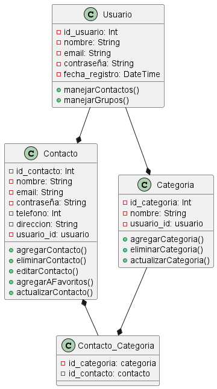

# Código WSD 
 ```js

        @startuml
  class Contacto {
      -id_contacto: Int
      -nombre: String
      -email: String
      -contraseña: String
      -telefono: Int
      -direccion: String
      -usuario_id: usuario
      +agregarContacto()
      +eliminarContacto()
      +editarContacto()
      +agregarAFavoritos()
      +actualizarContacto()
  }

  class Usuario {
      -id_usuario: Int
      -nombre: String
      -email: String
      -contraseña: String
      -fecha_registro: DateTime
      +manejarContactos()
      +manejarGrupos()
  }

  class Categoria {
      -id_categoria: Int
      -nombre: String
      -usuario_id: usuario
      +agregarCategoria()
      +eliminarCategoria()
      +actualizarCategoria()
  }

  class Contacto_Categoria {
      -id_categoria: categoria
      -id_contacto: contacto
  }

Contacto *-- Contacto_Categoria
Usuario --* Contacto
Categoria --* Contacto_Categoria
Usuario --* Categoria
@enduml

```

# Imagen del diagrama 


# Explicación del diagrama de clases 

## Descripción del ejercicio 
La aplicación de gestión de contactos permite a los usuarios almacenar, organizar y acceder a su información de contacto de manera eficiente y segura. 
Ofrece funcionalidades para registrar y clasificar contactos en categorías personalizadas, facilitando la búsqueda y el acceso rápido a la información. Los usuarios pueden crear una cuenta para gestionar sus contactos de forma privada, editar y eliminar entradas,
 y organizar contactos en grupos como "Familia", "Amigos" o "Trabajo". Su objetivo es brindar una herramienta intuitiva y flexible  para uso personal, asegurando que la información esté organizada y disponible de manera conveniente.

## Explicación del diagrama

# # Diagrama UML de Gestión de Contactos

Este diagrama representa la estructura y funcionalidad de una aplicación de gestión de contactos.
El sistema incluye clases para Contactos, Usuarios, Categorías de contactos y una relación entre Contactos y Categorías.

## Descripción de Clases y Relaciones

### Clases Principales

1. **Contacto**
   - Atributos:
     - `id_contacto`: Identificador único del contacto.
     - `nombre`: Nombre del contacto.
     - `email`: Dirección de correo electrónico del contacto.
     - `contraseña`: Contraseña asociada al contacto (encriptada).
     - `telefono`: Número de teléfono del contacto.
     - `direccion`: Dirección física del contacto.
     - `usuario_id`: Identificador del usuario al que pertenece el contacto.
   - Métodos:
     - `agregarContacto()`: Agrega un nuevo contacto al sistema.
     - `eliminarContacto()`: Elimina un contacto existente.
     - `editarContacto()`: Edita los detalles de un contacto.
     - `agregarAFavoritos()`: Marca el contacto como favorito.
     - `actualizarContacto()`: Realiza una actualización de la información del contacto.

2. **Usuario**
   - Atributos:
     - `id_usuario`: Identificador único del usuario.
     - `nombre`: Nombre del usuario.
     - `email`: Dirección de correo electrónico del usuario.
     - `contraseña`: Contraseña del usuario.
     - `fecha_registro`: Fecha y hora de registro en el sistema.
   - Métodos:
     - `manejarContactos()`: Gestiona la lista de contactos del usuario.
     - `manejarGrupos()`: Administra los grupos de contactos.

3. **Categoria**
   - Atributos:
     - `id_categoria`: Identificador único de la categoría.
     - `nombre`: Nombre de la categoría de contacto.
     - `usuario_id`: Identificador del usuario que crea la categoría.
   - Métodos:
     - `agregarCategoria()`: Agrega una nueva categoría.
     - `eliminarCategoria()`: Elimina una categoría existente.
     - `actualizarCategoria()`: Actualiza los detalles de una categoría.

4. **Contacto_Categoria**
   - Esta clase representa la relación muchos-a-muchos entre Contactos y Categorías.
   - Atributos:
     - `id_categoria`: Identificador de la categoría a la que pertenece el contacto.
     - `id_contacto`: Identificador del contacto en la categoría.

### Relaciones entre Clases

- **Contacto** y **Contacto_Categoria** tienen una relación de composición, ya que un contacto puede estar asociado a varias categorías y cada categoría puede contener varios contactos.
- **Usuario** y **Contacto** tienen una relación de agregación, ya que un usuario puede tener múltiples contactos.
- **Categoria** y **Contacto_Categoria** también tienen una relación de composición para permitir la asociación entre contactos y categorías.
- **Usuario** y **Categoria** tienen una relación de agregación, donde un usuario puede crear múltiples categorías.


